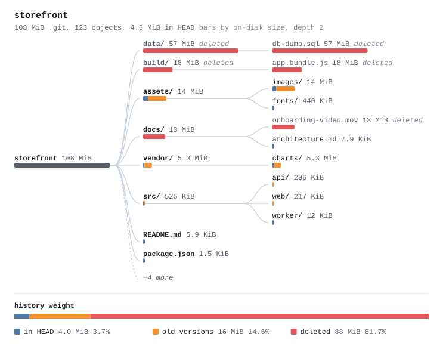

# gitsize

Why is my `.git` so big? `gitsize` finds the blobs that cost the most across all of history, tells you whether each one still exists in HEAD and which commit introduced it, and prints the exact command to remove it if you decide to.

It only reads. It never rewrites history, never runs `gc`, never fetches.



## Why

`git count-objects -vH` tells you the repository is 486 MiB. It does not tell you that 180 MiB of that is a `database.sql` somebody committed in 2024 and deleted the next day. Finding that by hand means chaining `rev-list`, `cat-file`, `sort` and `log --find-object` together. `gitsize` does it in one command, streams every object through a single `git cat-file` process, and finds all introducing commits in one `git log` pass, so it stays fast on repositories with hundreds of thousands of objects.

## Contents

- [Requirements](#requirements)
- [Install](#install) (macOS, Linux, Windows)
- [Usage](#usage)
  - [SVG diagram](#svg-diagram)
- [Use with AI agents](#use-with-ai-agents)
- [Flags](#flags)
- [What the numbers mean](#what-the-numbers-mean)
- [JSON output](#json-output)
- [Exit codes](#exit-codes)
- [Limitations](#limitations)

## Requirements

- **git 2.31 or newer** on your `PATH` (`git --version` to check). gitsize shells out to the git CLI and does not bundle a git implementation.
- **Go 1.22 or newer**, only if you install with `go install` or build from source.

gitsize is a single static binary with no dependencies beyond git. It runs on macOS (Intel and Apple Silicon), Linux (amd64, arm64 and others) and Windows (amd64, arm64). CI runs the full test suite on all three.

With git 2.50 or newer, file paths are read NUL-delimited, so paths containing newlines are reported exactly. Older git (2.31 to 2.49) works too; see [Limitations](#limitations).

## Install

### macOS

1. Install git and Go if you do not have them. With [Homebrew](https://brew.sh):

   ```sh
   brew install git go
   ```

   (The git that ships with Xcode Command Line Tools also works if it is 2.31 or newer.)

2. Install gitsize:

   ```sh
   go install github.com/Mr-hunt-007/gitsize@latest
   ```

3. Make sure Go's bin directory is on your `PATH`. For zsh (the default shell):

   ```sh
   echo 'export PATH="$PATH:$(go env GOPATH)/bin"' >> ~/.zshrc
   source ~/.zshrc
   ```

   For bash use `~/.bash_profile` instead of `~/.zshrc`.

4. Check it works:

   ```sh
   gitsize --version
   ```

### Linux

1. Install git and Go.

   Debian / Ubuntu:

   ```sh
   sudo apt update && sudo apt install -y git golang-go
   ```

   Fedora / RHEL:

   ```sh
   sudo dnf install -y git golang
   ```

   Arch:

   ```sh
   sudo pacman -S git go
   ```

   Distribution Go packages are sometimes older than 1.22. If `go version` prints something older, install Go from [go.dev/dl](https://go.dev/dl/) instead.

2. Install gitsize:

   ```sh
   go install github.com/Mr-hunt-007/gitsize@latest
   ```

3. Put Go's bin directory on your `PATH` (bash shown; use `~/.zshrc` for zsh):

   ```sh
   echo 'export PATH="$PATH:$(go env GOPATH)/bin"' >> ~/.bashrc
   source ~/.bashrc
   ```

4. Check it works:

   ```sh
   gitsize --version
   ```

### Windows

1. Install Git for Windows and Go. With winget in PowerShell:

   ```powershell
   winget install --id Git.Git -e
   winget install --id GoLang.Go -e
   ```

   Or download the installers from [git-scm.com](https://git-scm.com/download/win) and [go.dev/dl](https://go.dev/dl/). Close and reopen the terminal afterwards so the new `PATH` is picked up.

2. Install gitsize:

   ```powershell
   go install github.com/Mr-hunt-007/gitsize@latest
   ```

   This puts `gitsize.exe` in `%USERPROFILE%\go\bin`. The Go installer normally adds that folder to your `PATH`. If `gitsize` is not found, add it for your user:

   ```powershell
   [Environment]::SetEnvironmentVariable("Path", $env:Path + ";$(go env GOPATH)\bin", "User")
   ```

   then open a new terminal.

3. Check it works (PowerShell, cmd or Git Bash):

   ```powershell
   gitsize --version
   gitsize C:\src\myapp
   ```

The "how to fix" commands gitsize prints use POSIX shell quoting. On Windows, run them from Git Bash, which comes with Git for Windows.

### Build from source (any OS)

```sh
git clone https://github.com/Mr-hunt-007/gitsize.git
cd gitsize
go build -o gitsize .        # on Windows: go build -o gitsize.exe .
./gitsize --version
```

Cross-compile for another OS from any machine (no C toolchain needed):

```sh
GOOS=linux   GOARCH=amd64 go build -o dist/gitsize-linux-amd64 .
GOOS=darwin  GOARCH=arm64 go build -o dist/gitsize-darwin-arm64 .
GOOS=windows GOARCH=amd64 go build -o dist/gitsize-windows-amd64.exe .
```

In PowerShell, set the variables first: `$env:GOOS="linux"; $env:GOARCH="amd64"; go build -o dist/gitsize-linux-amd64 .`

Run the tests:

```sh
go test ./...
```

## Usage

```
gitsize [flags] [repo-path]
```

`repo-path` defaults to the current directory. Any directory inside a work tree works, as does a bare repository.

A repository where a 9 MB dump was committed and later deleted:

```
$ gitsize
Repository: myapp
.git          15 MiB  (packed 15 MiB, loose 0 B, 21 objects)
Checkout     5.2 MiB  (files in HEAD: 4)
Blobs         15 MiB  (7 blob versions in all history, 15 MiB uncompressed)

Largest blobs (all history, by on-disk size):
    ON DISK       SIZE  STATUS       INTRODUCED          PATH
    8.6 MiB    8.6 MiB  deleted      c4f9ec9 2024-03-02  database.sql
    3.8 MiB    3.8 MiB  in HEAD      466c91f 2024-03-15  backup.zip
    1.4 MiB    1.4 MiB  old version  466c91f 2024-03-15  assets/hero image.png
    1.3 MiB    1.3 MiB  in HEAD      588a94c 2024-05-20  assets/hero image.png
     30 KiB     39 KiB  in HEAD      588a94c 2024-05-20  src/app.js
     20 KiB     26 KiB  old version  ecdfd1e 2024-01-10  src/app.js
       17 B        8 B  in HEAD      ecdfd1e 2024-01-10  README.md

How to fix:
  1 deleted path, 8.6 MiB on disk, still in history:
    database.sql
  "Deleted" means absent from HEAD. Make sure no branch you still use needs them.

  WARNING: both commands below rewrite history. Every commit from the first
  one touching these paths gets a new id, on every branch and tag. Back up
  first, run it in a fresh clone, force-push, and have every collaborator
  re-clone. gitsize never rewrites anything itself.

  With git-filter-repo (https://github.com/newren/git-filter-repo):
    git filter-repo --invert-paths --path database.sql

  Or with BFG Repo-Cleaner (matches by file name in any directory, and
  leaves the files in your latest commit untouched):
    bfg --delete-files database.sql
    git reflog expire --expire=now --all && git gc --prune=now --aggressive
```

The "How to fix" section only appears when a path that is no longer in HEAD has at least 1 MiB of history on disk.

Sum every version of each path (a file rewritten 200 times can cost more than one big file):

```
$ gitsize --by path --largest 3
...
Largest paths (all versions summed, by on-disk size):
    ON DISK       SIZE  VERSIONS  STATUS       FIRST ADDED         PATH
    8.6 MiB    8.6 MiB         1  deleted      c4f9ec9 2024-03-02  database.sql
    3.8 MiB    3.8 MiB         1  in HEAD      466c91f 2024-03-15  backup.zip
    2.8 MiB    2.8 MiB         2  in HEAD      466c91f 2024-03-15  assets/hero image.png
```

Break it down by extension (`--by dir` does the same per directory):

```
$ gitsize --by ext --largest 4
...
Extensions (all history, by on-disk size):
    ON DISK       SIZE    BLOBS  EXTENSION
    8.6 MiB    8.6 MiB        1  .sql
    3.8 MiB    3.8 MiB        1  .zip
    2.8 MiB    2.8 MiB        2  .png
     49 KiB     65 KiB        2  .js
```

See when the repository grew:

```
$ gitsize --history --largest 2
...
Growth (new blob bytes on disk, by month first committed, UTC):
  2024-01  #                                            20 KiB  2 blobs
  2024-02                                                  0 B  0 blobs
  2024-03  ########################################     14 MiB  3 blobs
  2024-04                                                  0 B  0 blobs
  2024-05  ####                                        1.4 MiB  2 blobs
```

More examples:

```sh
gitsize ~/src/myapp --largest 25       # more rows
gitsize --sort size                    # rank by uncompressed size instead
gitsize --json | jq '.largest_blobs[0]'
gitsize /srv/git/project.git           # bare repository
```

### SVG diagram

`--svg` also writes a diagram of where the history weight lives. The normal output still prints. Without a file name it is saved as `<repo>-gitsize.svg` in the current directory, where `<repo>` is the repository's top-level directory name (for a bare repository, its name without `.git`):

```
$ gitsize --svg storefront > /dev/null
gitsize: wrote storefront-gitsize.svg
```

```sh
gitsize --svg                            # writes myapp-gitsize.svg, even from a subdirectory of myapp
gitsize --svg docs/weight.svg ~/src/app  # choose the file; any name ending in .svg
gitsize --svg --svg-depth 3 --sort size  # deeper tree, bars by uncompressed size
```

The diagram at the top of this README comes from a demo repository. It is a tree of directories, then files, where every version of every path in history is summed, so a file rewritten 50 times or deleted long ago weighs what it really costs in `.git`. Bars are sized by on-disk bytes (`--sort size` switches to uncompressed). It draws 2 levels by default (`--svg-depth N`, 0 for unlimited; deeper directories become one bar), the 8 heaviest entries at the first level and 5 below that, with the rest as `+N more`. Directories end in `/`. Paths that are not in HEAD (or directories with nothing left in HEAD) have a muted label marked `deleted`. Hovering a node shows exact sizes, the number of versions, how the bytes split between HEAD, old versions and deleted, and for files the introducing commit.

The "history weight" strip splits all blob bytes into `in HEAD` (blobs in the HEAD commit), `old versions` (other content of paths that still exist) and `deleted` (paths absent from HEAD), using the same statuses as the table. Empty slices are left out. Every bar in the tree is split the same way with the same colours (blue in HEAD, orange old versions, red deleted), so a mostly red bar is weight you can only reclaim by rewriting history. With `--sort size` the bar length is uncompressed bytes and the split keeps the on-disk proportions. The file follows the viewer's light or dark scheme and has no external references, so it renders on GitHub as is.

## Use with AI agents

The CLI already works well from coding agents: `gitsize --json` prints one stable JSON object and the [exit codes](#exit-codes) are documented.

`gitsize --mcp` also runs gitsize as an [MCP](https://modelcontextprotocol.io) server over stdio, so agents can call it as a tool. The client starts the process itself, so `gitsize` must be on the `PATH` the client sees. GUI apps often do not inherit your shell's `PATH`; if the server fails to start, use the absolute path of the binary instead (print it with `echo "$(go env GOPATH)/bin/gitsize"`, or `%USERPROFILE%\go\bin\gitsize.exe` on Windows).

**Claude Code**

```sh
claude mcp add gitsize -- gitsize --mcp
```

Add `--scope user` before the name (`claude mcp add --scope user gitsize -- gitsize --mcp`) to enable it in every project.

**Codex CLI**

```sh
codex mcp add gitsize -- gitsize --mcp
```

or in `~/.codex/config.toml`:

```toml
[mcp_servers.gitsize]
command = "gitsize"
args = ["--mcp"]
```

**Cursor**: `.cursor/mcp.json` in the project (or `~/.cursor/mcp.json` for all projects):

```json
{
  "mcpServers": {
    "gitsize": { "command": "gitsize", "args": ["--mcp"] }
  }
}
```

**VS Code**: `.vscode/mcp.json`:

```json
{
  "servers": {
    "gitsize": { "type": "stdio", "command": "gitsize", "args": ["--mcp"] }
  }
}
```

**Gemini CLI**: `~/.gemini/settings.json` (or `.gemini/settings.json` in the project):

```json
{
  "mcpServers": {
    "gitsize": { "command": "gitsize", "args": ["--mcp"] }
  }
}
```

Tools:

| Tool | Access | What it answers |
|---|---|---|
| `gitsize_report` | read-only | Why `.git` is big: largest blobs, paths, extensions or directories in all history, status relative to HEAD, introducing commits, optional growth per month, and suggested fix commands. Same JSON as `--json`. Arguments: `dir`, `largest` (default 10, max 100), `sort`, `by`, `history`. |
| `gitsize_svg` | writes a file | Writes the `--svg` diagram (`dir`, `output`, `depth`, `sort`) and returns the absolute path, whether an earlier gitsize SVG was replaced, and the in HEAD, old versions and deleted byte totals. `output` defaults to `<repo>-gitsize.svg` in the server's working directory. |

The tool never rewrites history. The `git filter-repo` and BFG commands in `fix` are text for a human to review, and the result says so in `notes`. When rows are cut by `largest`, `notes` says how many existed. Relative `dir` values resolve against the working directory the client starts the server in, which varies by client; pass an absolute path when in doubt. Cancelling a call stops its git processes.

`gitsize_svg` never overwrites a file it did not write: an existing file at `output` is replaced only when it is an SVG written by gitsize, otherwise the call fails. The output directory must already exist.

gitsize has no destructive tools, so `--allow-destructive` (accepted for consistency with related tools) changes nothing.

**Agent Skill.** `skills/gitsize/SKILL.md` teaches an agent when and how to run the CLI. Install it for Claude Code with:

```sh
mkdir -p ~/.claude/skills && cp -r skills/gitsize ~/.claude/skills/
```

For Codex, copy it to `~/.agents/skills/` instead. Contributors and agents working on this repository should read [AGENTS.md](AGENTS.md).

## Flags

| Flag | Default | Description |
|---|---|---|
| `--largest N` | `10` | Rows to show. Also caps the paths listed in "How to fix". |
| `--sort disk\|size` | `disk` | `disk`: bytes the object occupies in `.git` (compressed, after delta). `size`: uncompressed content size. |
| `--by blob\|path\|ext\|dir` | `blob` | `blob`: individual blob versions. `path`: all versions of a path summed. `ext`: by lower-cased file extension. `dir`: by the directory directly containing the file (not rolled up into parents). |
| `--history` | off | Growth chart: bytes of blobs first committed in each month. |
| `--json` | off | Machine-readable output (see below). |
| `--svg [FILE]` | off | Also write an SVG diagram of where history weight lives ([SVG diagram](#svg-diagram)). Without `FILE` (or when the next argument does not end in `.svg`) it is saved as `<repo>-gitsize.svg` in the current directory. The CLI overwrites `FILE` if it exists. |
| `--svg-depth N` | `2` | Levels drawn in the SVG; `0` is unlimited. Only valid with `--svg`. |
| `--no-color` | off | Disable colour. Colour is also off when `NO_COLOR` is set or stdout is not a terminal. |
| `--mcp` | off | Run as an MCP server on stdin/stdout. Other flags are ignored. See [Use with AI agents](#use-with-ai-agents). |
| `--allow-destructive` | off | Only valid with `--mcp`. Accepted for consistency; gitsize has no destructive tools. |
| `--version` | | Print the version. |
| `-h`, `--help` | | Help with examples. |

Flags may come before or after the repository path.

## What the numbers mean

| Line | Source |
|---|---|
| `.git` | Space used by every file in the git directory, measured like `du` (allocated blocks on macOS and Linux, file sizes on Windows). Includes packs, loose objects, the index, logs, hooks and any LFS cache. |
| `packed`, `loose`, `objects` | `git count-objects -v`, converted from KiB to bytes. |
| `Checkout` | Sum of the sizes of the files in the HEAD commit, from `git ls-tree -r -l HEAD`. Untracked and ignored files are not counted. Shown as `HEAD tree` for bare repositories. |
| `Blobs` | Every blob reachable from any branch, tag, remote-tracking ref, stash or HEAD: `git rev-list --objects --all` piped into one `git cat-file --batch-check` process. The first number is on-disk bytes, the second uncompressed bytes. |
| `ON DISK` | `%(objectsize:disk)`: bytes this object takes in its pack (or its loose file). For a delta this is the delta, not the full content. |
| `SIZE` | `%(objectsize)`: uncompressed content size. |
| `STATUS` | `in HEAD`: this exact blob is in the HEAD commit. `old version`: the path is in HEAD but with different content. `deleted`: the path is not in HEAD. `unknown`: HEAD does not resolve to a commit. |
| `INTRODUCED` | The earliest commit, by committer date, whose diff adds this blob (or, in `--by path`, first adds the path). Found with one `git log --all --raw` pass. Merge commits are diffed against their first parent. |

Sizes use binary units (1 MiB = 1,048,576 bytes), the same as `git count-objects -vH` and `du -h`.

gitsize also adds notes when they apply: a shallow clone (results cover only local history), a partial clone (filtered objects are skipped, never fetched), Git LFS pointer files (with the total size of the LFS content they reference, which is stored outside these objects), and object storage that is not reachable from any ref (reflog-only commits, deleted branches, unpruned objects), which is not in the tables.

## JSON output

`--json` prints one object. `schema` is bumped on any breaking change. Only the list matching `--by` is present (`largest_blobs`, `largest_paths`, `by_ext` or `by_dir`); `history` is present only with `--history`. `head_tree`, `lfs`, `fix` and `introduced` are `null` when they do not apply. All sizes are bytes; times are Unix seconds and dates are UTC.

Real output of `gitsize --largest 1 --json` on the example repository (paths shortened):

```json
{
  "schema": 1,
  "repository": {
    "name": "myapp",
    "git_dir": "/home/me/src/myapp/.git",
    "work_tree": "/home/me/src/myapp",
    "bare": false,
    "shallow": false,
    "partial_clone": false,
    "empty": false,
    "head_resolves": true,
    "git_version": "2.50.1"
  },
  "storage": {
    "git_dir_bytes": 16072704,
    "packed_bytes": 15958016,
    "loose_bytes": 0,
    "objects": 21,
    "lfs_cache_bytes": 0
  },
  "head_tree": {
    "files": 4,
    "bytes": 5440009,
    "sizes_unknown": 0
  },
  "reachable": {
    "objects": 21,
    "disk_bytes": 15956875,
    "blobs": 7,
    "blob_bytes": 15966678,
    "blob_disk_bytes": 15955455,
    "missing": 0
  },
  "options": {
    "largest": 1,
    "sort": "disk",
    "by": "blob",
    "history": false
  },
  "largest_blobs": [
    {
      "path": "database.sql",
      "oid": "4e6e2b8b66a3b9b5c0a3bcda2604ee8ba3b7438f",
      "size": 9000000,
      "disk": 9002760,
      "status": "deleted",
      "introduced": {
        "commit": "c4f9ec932d844f629c52caf8303c85e536224588",
        "time": 1709373600,
        "date": "2024-03-02"
      }
    }
  ],
  "lfs": null,
  "fix": {
    "paths": [
      "database.sql"
    ],
    "disk_bytes": 9002760,
    "filter_repo": "git filter-repo --invert-paths --path database.sql",
    "bfg": [
      "bfg --delete-files database.sql"
    ]
  },
  "notes": [],
  "count_objects": {
    "loose_objects": 0,
    "loose_bytes": 0,
    "packed_objects": 21,
    "packs": 1,
    "packed_bytes": 15958016,
    "prune_packable": 0,
    "garbage_files": 0,
    "garbage_bytes": 0
  }
}
```

Other shapes:

- `largest_paths[]`: `path`, `versions`, `size`, `disk`, `status` (`in HEAD`, `deleted`, `unknown`), `introduced`.
- `by_ext[]` and `by_dir[]`: `key`, `blobs`, `size`, `disk`. The keys `(none)` and `(root)` mean no extension and the repository root.
- `history`: `months[]` of `month` (`YYYY-MM`), `blobs`, `size`, `disk`, including empty months, plus `unattributed` for blobs reachable but never seen in a commit diff.
- `lfs`: `pointer_blobs`, `pointers_in_head`, `lfs_objects`, `lfs_content_bytes`, `attributes_in_head`.
- `largest_blobs[].lfs_pointer` is `true` for LFS pointer files.

## Exit codes

| Code | Meaning |
|---|---|
| 0 | Success (including an empty repository) |
| 1 | A git command failed or its output could not be parsed |
| 2 | Invalid flags or arguments |
| 3 | The path is not a git repository (or does not exist) |
| 4 | git is not installed or is older than 2.31 |

## Limitations

- **One path per blob.** `git rev-list --objects` names each blob with the first path it was reached by. If identical content lives at two paths, only one is shown, and `--by path`, `--by ext` and `--by dir` count it once, under that path.
- **"Deleted" is relative to HEAD.** A file removed on `main` but still present on another branch shows as `deleted`. The fix commands remove the path from every branch and tag, so check before running them.
- **On-disk size of deltas.** A deltified blob's on-disk size is only its delta; the base it depends on is counted on another blob. Removing one version can therefore free more or less than its `ON DISK` figure until the repository is repacked.
- **Introducing commit** is the earliest by committer date among commits whose diff adds the blob. Rebased or cherry-picked copies keep their own dates. A blob that only enters history through a merge resolution is attributed to that merge.
- **Growth chart** buckets blobs by the month of that earliest commit in UTC, not by when they were pushed.
- **Shallow clones** only contain history down to the shallow boundary, and the boundary commit appears to introduce every file in it.
- **Partial clones**: filtered-out objects are skipped, never fetched, so totals are lower than on the server.
- **Git LFS** is detected when HEAD's `.gitattributes` uses `filter=lfs` or a local `.git/lfs` directory exists. LFS-only history without either is not detected.
- **git older than 2.50** cannot print object paths NUL-delimited, so a path containing a newline is shown truncated at the newline. Sizes and counts are still correct.
- **Fix commands** use POSIX shell quoting (run them in Git Bash on Windows). BFG matches by file name, so `bfg --delete-files` also strips same-named files in other directories from older history. Paths that are now directories in HEAD are never suggested.
- **SVG diagram** sums blob versions under the path `rev-list` reached them by (see "One path per blob"), and a renamed file appears under both names. The strip's `in HEAD` counts a blob as in HEAD when the same content is in the HEAD commit at any path.
- `.git` on Windows is the sum of file sizes, not allocated blocks, so it can differ slightly from Explorer's "size on disk".

## License

MIT. See [LICENSE](LICENSE).
